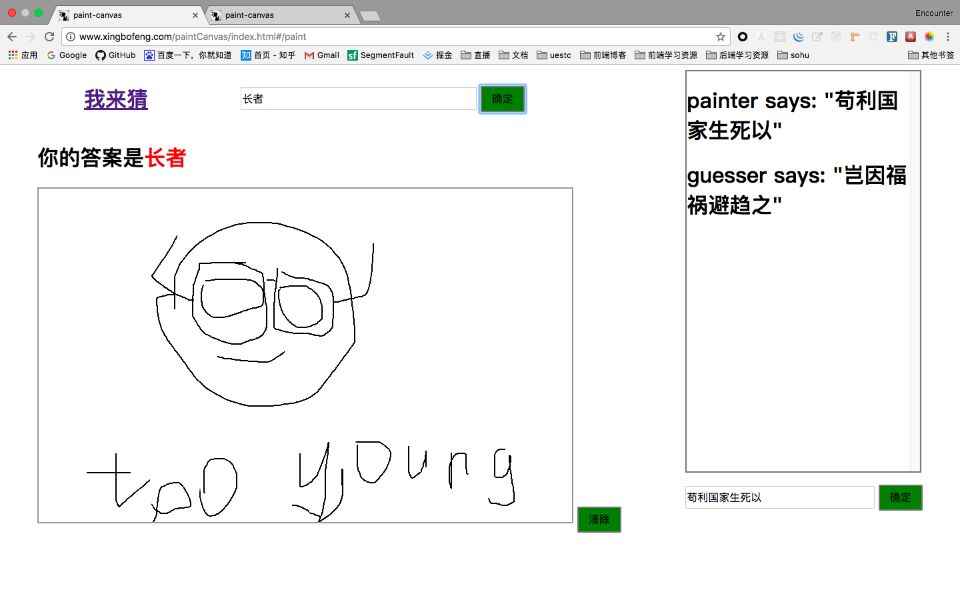
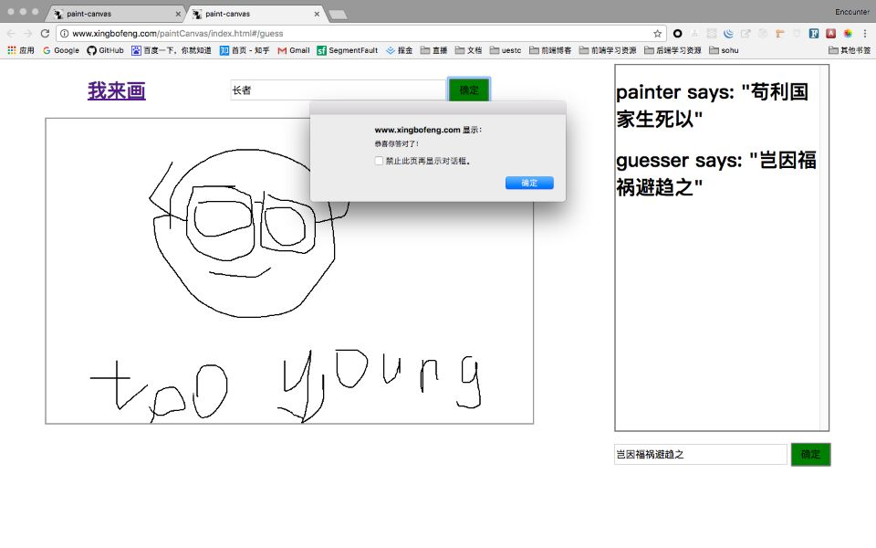

# paintCanvas

:art: paintCanvas是基于`vue`的你画我猜小游戏。

## [猛戳这里查看Demo](http://www.xingbofeng.com/paintCanvas/index.html#/paint)
## 技术栈
* `socket.io`
* `vue`

## 浏览器兹词
只兹词`高版本chrome`，请更换您的`辣鸡浏览器`。
## 运行效果



## 依赖版本
`node v7.1.0`

注：由于本项目使用了部分es6的语法，因此需要较高版本的node环境，建议升级node版本运行。

## 目录说明
- `src/`: 项目前端部分代码;
- `static/`: 项目静态文件部分;
- `server/`: 项目服务端代码，目前已部署到我的`测试服务器`(接口为`http://angryzhangzhe.cn:2017`)，非商业可自由使用;
- `test/`: 单元测试代码所在目录;

## 使用方法
* 下载本项目
```
git clone https://github.com/xingbofeng/paintCanvas.git
```

* 启动服务端
注：本项目服务端代码我已部署到我自己的`测试服务器`(接口为`http://angryzhangzhe.cn:2017`)上，可在线查看。若想本地调试接口，您可以通过以下命令启动本地服务端：
```
npm install
npm start
```

* 运行单元测试
待完成ing......

## 待做事件清单
- [x] 即时聊天
- [ ] 单元测试
- [x] 正误判断
- [ ] 界面样式

## 更新日志
* 1.0.0 : 完成同步画图、即时聊天、正误判断功能;
* 1.0.1 : 修复聊天不滑动到底部的bug;修复聊天发送后不清除已输入的聊天信息的bug;修复了超过边界会重复无限画图的bug;
## LICENSE
[MIT LICENSE](./LICENSE)
